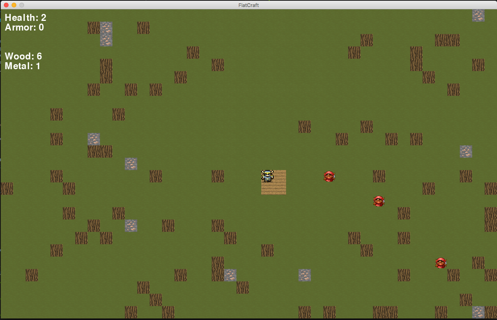

# FlatCraft

Stripped down 2D version of Minecraft using the pygame library

Move using arrow keys. Quit using Cmd + Q or Windows + Q.

A new goblin spawns every two seconds from the lower right corner and starts 
moving toward the player. If a goblin touches the player, the goblin dies and 
the player takes 1 damage. If a goblin touches a player with 1 health and no 
armor, the player dies and the game quits.

The player can harvest wood and metal by moving onto the harvestable tile and 
using the space bar.

Armor can be crafted and equipped using the 'a' key using two metal from the 
inventory. Each piece of armor can take 1 damage.

Houses can be crafted and placed using the 'h' key using four wood from the 
inventory. The house can't be placed on harvestable wood or metal but CAN be 
placed on a goblin. Which will kill it. And it is very satisfying. The goblins can't
enter the house but will pile up patiently outside it waiting for the player.

